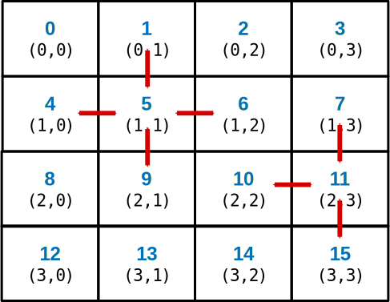
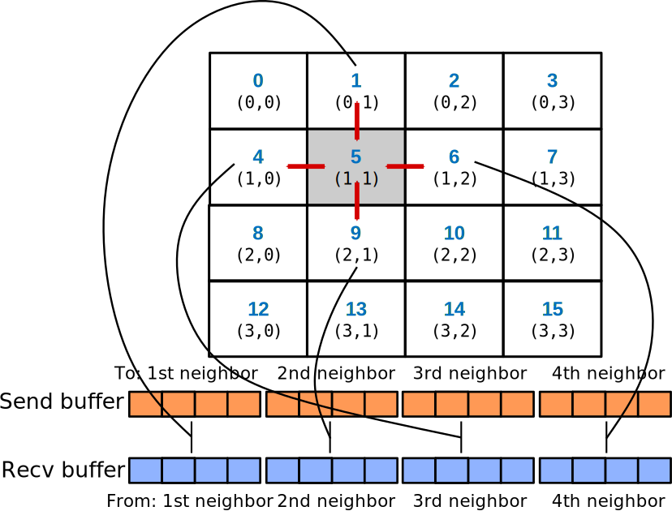

# Persistent communication {.section}

# Persistent communication

- Often a communication with same argument list is repeatedly executed
- It may be possible to optimize such pattern by persistent communication requests
    - Can be thought as a ”communication port”
- Usage:
    - Create requests: `MPI_Send_init` & `MPI_Recv_init`
        - Initiation and starting of communication separated in addition to communication and completion
    - Start communication: `MPI_Start` / `MPI_Startall`
    - Complete communication: `MPI_Wait` / `MPI_Waitall`
- Recently published (June 2021) MPI 4.0 includes also persistent
  collectives
    - Not supported by all implementations yet

# Persistent point-to-point communication

```c
MPI_Request recv_obj, send_obj;
...
// Initialize send/request objects
MPI_Recv_init(buf1, cnt, MPI_DOUBLE, src, tag, MPI_COMM_WORLD, &recv_obj);
MPI_Send_init(buf2, cnt, MPI_DOUBLE, dst, tag, MPI_COMM_WORLD, &send_obj);
for (i=1; i<BIGNUM; i++){
// Start communication described by recv_obj and send_obj
    MPI_Start(&recv_obj);
    MPI_Start(&send_obj);
    // Do work, e.g. update the interior domains 
    ...
    // Wait for send and receive to complete
    MPI_Wait(&send_obj, MPI_STATUS_IGNORE);
    MPI_Wait(&recv_obj, MPI_STATUS_IGNORE);
}
//Clean up the requests
MPI_Request_free (&recv_obj); MPI_Request_free (&send_obj);
```

# Neighborhood collectives {.section}

# Neighborhood collectives

- Neighborhood collectives build on top of process topologies
- Provide optimization possibilities for MPI library for communication
  patterns involving neighbors
    - Nearest neighbors in cartesian topology
	- Processes connected by a edge in a general graph
- Similar to ordinary collectives, all tasks within a communicator
  need to call the routine
- Possible to have multidimensional halo-exchange with a single MPI call

# Neighborhood collectives in cartesian grid

<div class=column>
- Only nearest neighbors, *i.e.* those corresponding to
  `MPI_Cart_shift` with displacement=1.
- Boundaries in finite dimensions treated as like with `MPI_PROC_NULL`
</div>

<div class=column>
{width=90%}
</div>

# Neighborhood collectives

- Two main neighborhood operations
    - `MPI_Neighbor_allgather` : send same data to all neighbors, receive different
      data from neighbors
	- `MPI_Neighbor_alltoall` : send and receive different data
      between all the neighbors
- Also variants where different number or type of elements is
  communicated
- Non-blocking versions with similar semantics than non-blocking
  collectives
    - Request parameter at the end of the list of arguments

# Neighbor data collection{.split-definition}

MPI_Neighbor_allgather(`sendbuf`{.input}, `sendcount`{.input}, `sendtype`{.input}, `recvbuf`{.output}, `recvcount`{.input}, `recvtype`{.input}, `comm`{.input})
  : `sendbuf`{.input} 
    : send buffer

    `sendcount`{.input} 
    : number of elements in send buffer

    `sendtype`{.input} 
    : data type of send buffer elements

    `-`{.ghost}
    : `-`{.ghost}
	
    `recvbuf`{.output} 
    : receive buffer

    `recvcount`{.input} 
    : number of elements received from each neighbor

    `recvtype`{.input} 
    : data type of receive buffer
	
	`comm`{.input} 
    : communicator with topology
	
# Receive buffer ordering in gather

<div class=column>
- `sendcount` = 4
- `recvbuffer` size = # neighbors x 4
- order of received data corresponds to `cart_shift` with `displ` = 1:
    - for each dimension, first from `src`, then from `dest`
</div>
<div class=column>
{width=90%}
</div>

# Receive buffer ordering in gather

- Equivalent point-to-point code:

```cpp
for (int i=0; i < ndims; i++) {
  MPI_Cart_shift(cart_comm, i, 1, &nghbrs[i][0], &nghbrs[i][1]);

  recv_offset = i * 2 * count;
  MPI_Irecv(recvbuf + recv_offset, count, MPI_INT, nghbrs[i][0], 1, cart_comm, &reqs[i*4];
  MPI_Irecv(recvbuf + recv_offset + 1, count, MPI_INT, nghbrs[i][1], 1, cart_comm, &reqs[i*4 + 1]);
  MPI_Isend(sendbuf, count, MPI_INT, nghbrs[i][0], 1, cart_comm, &reqs[i*4 + 2]);
  MPI_Isend(sendbuf, count, MPI_INT, nghbrs[i][1], 1, cart_comm, &reqs[i*4 + 3]);
}
MPI_Waitall(ndims*4, reqs, MPI_STATUSES_IGNORE);
```

# Neighbor all to all{.split-definition}

MPI_Neighbor_alltoall(`sendbuf`{.input}, `sendcount`{.input}, `sendtype`{.input}, `recvbuf`{.output}, `recvcount`{.input}, `recvtype`{.input}, `comm`{.input})
  : `sendbuf`{.input} 
    : send buffer

    `sendcount`{.input} 
    : number of elements sent to each neighbor

    `sendtype`{.input} 
    : data type of send buffer elements

    `-`{.ghost}
    : `-`{.ghost}
	
    `recvbuf`{.output} 
    : receive buffer

    `recvcount`{.input} 
    : number of elements received from each neighbor

    `recvtype`{.input} 
    : data type of receive buffer
	
	`comm`{.input} 
    : communicator with topology
	
# Buffer ordering in all to all

<div class=column>
- `sendcount` = 4
- `sendbuffer` size = # neighbors x 4
- `recvbuffer` size = # neighbors x 4
- order of received data corresponds to `cart_shift` with `displ` = 1:
    - for each dimension, first from `src`, then from `dest`
- sending follows same ordering
    - first to `src`, then to `dest`
</div>
<div class=column>
{width=90%}
</div>
	
# Buffer ordering in all to all

- Equivalent point-to-point code:

```cpp
for (int i=0; i < ndims; i++) {
  MPI_Cart_shift(cart_comm, i, 1, &nghbrs[i][0], &nghbrs[i][1]);

  offset = i * 2 * count;
  MPI_Irecv(recvbuf + offset, count, MPI_INT, nghbrs[i][0], 1, cart_comm, &reqs[i*4];
  MPI_Irecv(recvbuf + offset + 1, count, MPI_INT, nghbrs[i][1], 1, cart_comm, &reqs[i*4 + 1]);
  MPI_Isend(sendbuf + offset, count, MPI_INT, nghbrs[i][0], 1, cart_comm, &reqs[i*4 + 2]);
  MPI_Isend(sendbuf + offset + 1, count, MPI_INT, nghbrs[i][1], 1, cart_comm, &reqs[i*4 + 3]);
}
MPI_Waitall(ndims*4, reqs, MPI_STATUSES_IGNORE);
```

# Vector variants: gatherv{.split-definition}

MPI_Neighbor_allgatherv(`sendbuf`{.input}, `sendcount`{.input}, `sendtype`{.input}, `recvbuf`{.output}, `recvcounts`{.input}, `displs`{.input}, `recvtype`{.input}, `comm`{.input})
  : `sendbuf`{.input} 
    : send buffer

    `sendcount`{.input} 
    : number of elements in send buffer

    `sendtype`{.input} 
    : data type of send buffer elements

    `recvbuf`{.output} 
    : receive buffer

    `-`{.ghost}
    : `-`{.ghost}

    `recvcounts`{.input} 
    : array (of lenght neighbours). Number of elements received from each neighbor

    `displs`{.input} 
    : array (of lenght neighbours). Displacements relative to recvbuf

    `recvtype`{.input} 
    : data type of receive buffer
	
	`comm`{.input} 
    : communicator with topology

# Vector variants: alltoallv{.split-def-3}

MPI_Neighbor_alltoallv(`sendbuf`{.input}, `sendcounts`{.input}, `senddispls`{.input}, `sendtype`{.input}, `recvbuf`{.output}, `recvcounts`{.input}, `recvcounts`{.input} , `recvtype`{.input}, `comm`{.input})
  : `sendbuf`{.input} 
    : send buffer

    `sendcounts`{.input} 
    : array (of lenght neighbours). Number of elements sent to each neighbor

    `senddispls`{.input} 
    : array (of lenght neighbours). Displacements relative to sendbuf
	
    `sendtype`{.input} 
    : data type of send buffer elements

    `recvbuf`{.output} 
    : receive buffer

    `recvcounts`{.input} 
    : array (of lenght neighbours). Number of elements received from each neighbor

    `recvdispls`{.input} 
    : array (of lenght neighbours). Displacements relative to recvbuf

    `recvtype`{.input} 
    : data type of receive buffer
	
	`comm`{.input} 
    : communicator with topology

# Vector variants: alltoallw{.split-def-3}

MPI_Neighbor_alltoallw(`sendbuf`{.input}, `sendcounts`{.input}, `senddispls`{.input}, `sendtypes`{.input}, `recvbuf`{.output}, `recvcounts`{.input}, `recvdispls`{.input} , `recvtypes`{.input}, `comm`{.input})

  : `sendbuf`{.input} 
    : send buffer

    `sendcounts`{.input} 
    : array (of lenght neighbours). Number of elements sent to each neighbor

    `senddispls`{.input} 
    : array (of lenght neighbours). Displacements relative to sendbuf in bytes
	
    `sendtypes`{.input} 
    : array (of lenght neighbours). Data types of sent items	

    `recvbuf`{.output} 
    : receive buffer

    `recvcounts`{.input} 
    : array (of lenght neighbours). Number of elements received from each neighbor

    `recvdispls`{.input} 
    : array (of lenght neighbours). Displacements relative to recvbuf in bytes

    `recvtypes`{.input} 
    : array (of lenght neighbours). Data types of received items
	
	`comm`{.input} 
    : communicator with topology

# Summary

- In persistent communication the communication pattern remains constant
- All the parameters for the communication are set up in the initialization phase
    - Communication is started and finalized in separate steps
- Neighborhood collectives enable communication between neighbors in process topology 
  with a single MPI call
- Persistent and neighborhood communication provide optimization opportunities for MPI
  library
